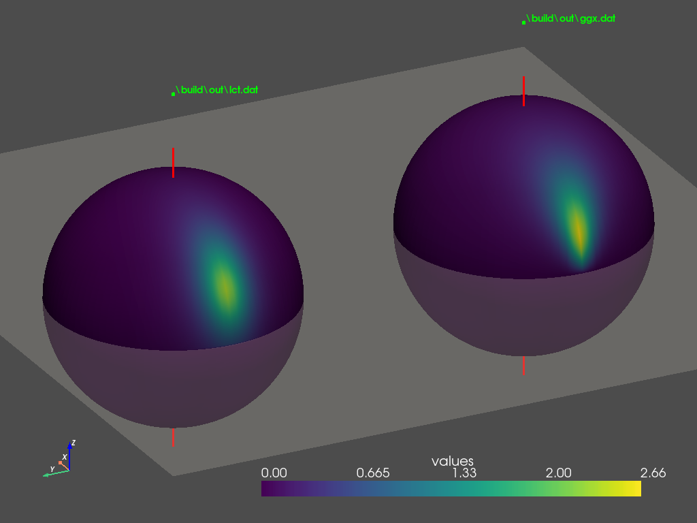

A small program that fits Linearly Transformed Cosine parameters to GGX BRDF. Largely inspired by [Eric Heitz's LTC research](https://eheitzresearch.wordpress.com/415-2/).

Also accounts for implementation caveats mentioned in the lecture [Real-Time Area Lighting:
a Journey from Research to Production](https://advances.realtimerendering.com/s2016/s2016_ltc_rnd.pdf) by Stephen Hill.

For implementation details checkout [this](https://yaographicsdev.github.io/2025/08/21/lct-fit.html) blog post.

## Input Parameters

```
LCTFit.exe [OPTIONS] SUBCOMMAND


OPTIONS:
  -h,     --help              Print this help message and exit
  -d,     --output-dir TEXT:DIR [./build/out]
                              output directory

SUBCOMMANDS:
  dist-ggx                    Print values of GGX BRDF on upper hemisphere to a file
  dist-lct                    Print values of LCT BRDF on upper hemisphere to a file
  dist                        Print values of LCT and GGX on upper hemisphere to files
  gen_luts                    write M matrix and albedo to textures
```

## Compute and Write GGX BRDF data
```
LCTFit.exe dist-ggx [OPTIONS]


OPTIONS:
  -h,     --help              Print this help message and exit
  -r,     --res INT [256]     sampling resolution of theta and phi
  -t,     --theta-multiplier FLOAT REQUIRED
                              theta multiplier. Viewing angle theta_v = multiplier * 0.5 * pi
  -u,     --roughness FLOAT REQUIRED
                              roughness
  -o,     --output TEXT [ggx.dat]
                              name of output data file
```

## Compute LCT BRDF data

```
LCTFit.exe dist-lct [OPTIONS]


OPTIONS:
  -h,     --help              Print this help message and exit
  -r,     --res INT [256]     sampling resolution of theta and phi
  -m,     --m-params FLOAT x 3 REQUIRED
                              Matrix M parameters. x-scale, x-z shear, y scale
  -y,     --y-angle FLOAT [0]
                              Angle of rotation around +y axis, in degrees
  -a,     --albedo FLOAT [1]  albedo parameter
  -o,     --output TEXT [lct.dat]
                              name of output data file
```

## Generate $\mathbf{M}$ Parameter LUTs

```
LCTFit.exe gen_luts [OPTIONS]


OPTIONS:
  -h,     --help              Print this help message and exit
  -t,     --theta-multiplier [INT,FLOAT,FLOAT] [64, 0.0, 0.99]
                              range of theta multiplier: <resolution> <min> <max>
  -r,     --roughness [INT,FLOAT,FLOAT] [64, 0.03, 1.0]
                              range of roughness: <resolution> <min> <max>
```

Data stored in each channel of each texture:

||Description|R|G|B|A|
|------|------|----|----|----|----|
|`lut_m.exr`|$\mathbf{m}$ matrix|$m_{11}$|$m_{13}$|$m_{22}$||
|`lut_b.exr`|$\mathbf{B}$ matrix|$\sin\bar{\theta_i}$|$\cos\bar{\theta_i}$|||
|`lut_bm_0.exr`|$\mathbf{Bm}$, i.e. $\mathbf{M}$|$a$|$b$|$c$|| 
|`lut_bm_1.exr`|$\mathbf{Bm}$, i.e. $\mathbf{M}$|$d$|$e$|$Albedo$||
|`lut_inv_0.exr`|$\mathbf{M^{-1}}$|$\dfrac{e}{\Delta}$|$-\dfrac{b}{\Delta}$|$\dfrac{1}{c}$|
|`lut_inv_1.exr`|$\mathbf{M^{-1}}$|$-\dfrac{d}{\Delta}$|$\dfrac{a}{\Delta}$|$Albedo$|
|`lut_norm_inv.exr`|$\mathbf{\hat{M}^{-1}}$|$\hat{a}$|$-\hat{b}$|$\dfrac{\hat{\Delta}}{\hat{c}}$|$-\hat{d}$|

Refer to the blog post for detailed descriptions of these parameters.

## Compute From Sampled $\mathbf{M}$ Parameter

```
LCTFit.exe sample_luts -h                                        sample textures containing M parameters


C:\Users\Liyao\Sources\lct_fitting\build\Release\LCTFit.exe sample_luts [OPTIONS] input_0 input_1


POSITIONALS:
  input_0 TEXT:FILE REQUIRED  LUT texture containing first 3 parameters of matrix M
  input_1 TEXT:FILE REQUIRED  LUT texture containing last 2 parameters of matrix M and albedo

OPTIONS:
  -h,     --help              Print this help message and exit
  -r,     --res INT [256]     sampling resolution of theta and phi
  -t,     --theta-multiplier FLOAT REQUIRED
                              theta multiplier. Viewing angle theta_v = multiplier * 0.5 * pi
  -u,     --roughness FLOAT REQUIRED
                              roughness
  -l,     --lct-filename TEXT [lct.dat]
                              name of LCT data file
```

## Python Script for Plotting Hemispherical Distribution

```
python3.7.exe .\python\plot_sphere.py -h
usage: plot_sphere.py [-h] [-o OUTPUT] [-v VIEW] datafiles [datafiles ...]

Plot hemispherical distributions

positional arguments:
  datafiles             Input data file(s)

optional arguments:
  -h, --help            show this help message and exit
  -o OUTPUT, --output OUTPUT
                        Output image file for headless mode
  -v VIEW, --view VIEW  Place camera at "x,y,z", looking at 0,0,0 point
```

## Use Case Examples

Generate $\mathbf{M}$ LUT textures with default parameters:
```
LCTFit.exe gen_luts
```
Generated textures will be saved in `.\out` directory.

Sample $\mathbf{M}$ parameters LUT at (0.54, 0.85), print corresponding LCT BRDF distribution to data file `.\out\lct.dat`

```
LCTFit.exe sample_luts -t 0.85 -u 0.54 .\out\lut_bm_0.exr .\out\lut_bm_1.exr
``` 

Print reference GGX BRDF distribution to data file `.\out\ggx.dat`:

```
LCTFit.exe dist-ggx -t 0.85 -u 0.54
```

Plot GGX and LCT distributions on 2 separate spheres side by side:

```
python3.7.exe plot_sphere.py .\out\ggx.dat .\out\lct.dat
```

This command will show an interactive window. Drag around to visually inspect the two distributions from any direction.

If you want to plot these distributions headlessly and save them as an image directly, run

```
 python3.7.exe plot_sphere.py -o distributions.png -v="-10,5,5" .\out\ggx.dat .\out\lct.dat
```

This command will plot the distributions, place the camera at (-10, 5, 5) and then take a screenshot of the plot and save the screenshot under the name `distributions.png`.




